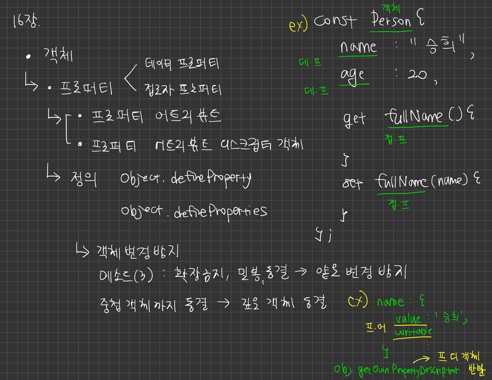

# 16장. 프로퍼티 어트리뷰트

## 16.1. 내부 슬롯과 내부 메서드

- 내부 슬롯, 내부 메서드 = 의사 프로퍼티, 의사 메서드
    - 자바 스크립트 엔진의 내부 로직
    - 원칙적으로 JS는 내부 슬롯과 내부 메서드에 ㅈㄱ접 접근하거나 호출할 수 있는 방법 제공 X
    - 일부 내부 슬롯, 내부 메서드에 한하여 간접 접근 수단 있음
        - [[Prototype]] 내부 슬롯의 경우, _ _proto_ _ 를 통해 간접적으로 접근 가능

## 16.2. 프로퍼티 어트리뷰트와 프로퍼티 디스크립터 객체

- JS 엔진은 프로퍼티를 생성할 때 프로퍼티의 상태를 나타내는 프로퍼티 어트리뷰트를 기본값으로 자동 정의
    - 프로퍼티의 상태란?
        - 프로퍼티의 값 value
        - 값의 갱신 여부 writable
        - 열거 가능 여부 enummutable
        - 재정의 가능 여부 configurable
- 프로퍼티 어트리뷰트는 JS 엔진이 관리하는 내부 상태 값인 내부 슬롯 Value, Writable, Enumerable, Configurable 이다.
    - 따라서 프로퍼티 어트리뷰트에 직접 접근할 수 없지만, Object.getOwnPropertyDescriptor 메서드를 사용하여 간접 확인
        - 하나의 프로퍼티에 대해 프로퍼티 디스크립터 객체를 반환
        - 만약 존재하지 않는 프로퍼티나 상속받은 프로퍼티에 대한 프로퍼티 디스크립터를 요구하면 undefine 반환
    - Object.getOwnPropertyDescriptors 메서드 : 모든 프로퍼티의 프로퍼티 어트리뷰트 정보를 제공하는 프로퍼티 디스크립터 객체들을 반환
    

## 16.3. 데이터 프로퍼티와 접근자 프로퍼티

- 프로퍼티는 두 개로 구분

### 데이터 프로퍼티

- 키와 값으로 구성된 일반적인 프로퍼티
    
    Value, Writable, Enumerable, Configurable
    

### 접근자 프로퍼티

- 자체적으로는 값을 갖지 않고 다른 데이터 프로퍼티의 값을 읽거나 저장할 때 호출되는 접근자 함수로 구성된 프로퍼티
    
    Get, Set, Enumerable, Configurable
    
- 접근자 함수는 getter,setter 함수라고도 부른다. 접근자 프로퍼티는 getter,setter 함수를 모두 정의할 수도 있고 하나만 정의할 수도 있다

### 프로토타입

- 프로토타입은 어떤 객체의 상위 객체 역할을 하는 객체다.
- 프로토타입은 하위 객체에게 자신의 프로퍼티와 메서드를 상속한다.
    - 프로토타입 객체의 프로퍼티나 메서드를 상속받은 하위 객체는 자신의 프로퍼티 또는 메서드인 것처럼 자유롭게 사용
- 프로토타입 체인은 프로토타입이 단방향 링크드 리스트 형태로 연결되어 있는 상속 구조
    - 객체의 프로퍼티나 메서드에 접근하려 할 때 해당 객체에 접근하려는 프로퍼티 또는 메서드가 없다면, 프로토타입 체인을 따라 프로토타입의 프로퍼티나 메서드를 차례대로 검색

## 16.4. 프로퍼티 정의

- 새로운 프로퍼티를 추가하면서 프로퍼티 어트리뷰트를 명시적으로 정의
- 기존 프로퍼티의 프로퍼티 어트리뷰트를 재정의

→ 프로퍼티 값 갱신 가능 여부, 열거 가능 여부, 재정의 가능 여부 정의

→ 객체의 프로퍼티가 어떻게 동작해야 하는지를 명확히 정의할 수 있다

- Object.defineProperty(객체의 참조, 데이터 프로퍼티의 키인 문자열, 프로퍼티 디스크립터 객체);
    - 한번에 하나의 프로퍼티만 정의 가능
    - 정의시 프로퍼티 디스크립터 객체의 프로퍼티를 일부 생략 가능 → 생략된 어트리뷰트는 기본값이 적용된다
    
    ```jsx
    - value → undefined
    - get → undefined
    - set → undefined
    - writable → false
    - enumerable → false
    - configurable → false
    ```
    
     
    
- Object.defineProperties - 여러개의 프로퍼티를 한 번에 정의

## 16.5. 객체 변경 방지

- 객체 = 변경 가능한 값
    - 재할당 없이 직접 변경 가능
    - 프로퍼티를 추가하거나 삭제 가능
    - 프로퍼티 값 갱신 가능
    - Object.defineProperty와 Object.defineProperties 메서드를 사용하여 프로퍼티 어트리뷰트를 재정의

- 객체의 변경을 방지하는 다양한 메서드 제공

| 구분 | 메서드 | 프로퍼티 추가 | 프로퍼티 삭제 | 프로퍼티 값 읽기 | 프로퍼티 값 쓰기 | 프로퍼티 어트리뷰트 재정의 |
| --- | --- | --- | --- | --- | --- | --- |
| 객체 확장 금지 | Object.preventExtensions | X | O | O | O | O |
| 객체 밀봉 | Object.seal | X | X | O | O | X |
| 객체 동결 | Object.freeze | X | X | O | X | X |

- 불변 객체
    - 앞의 변경방지 메서드들은 얕은 변경 방지로 직속 프로퍼티만 변경 방지되고 중첩 객체까지는 영향을 주지 못한다 → 중첩 객체까지 동결할 수 없다.
    - 객체의 중첩 객체까지 동결하여 변경이 불가능한 읽기 전용의 불변 객체를 구현하려면 객체를 값으로 갖는 모든 프로퍼티에 대해 재귀적으로 Object.freeze 메서드를 호출해야 한다.
